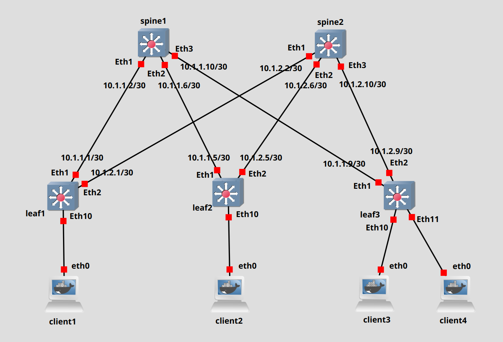

# Lab5
## Схема:


## Вопросы
- А как настраивать оверлей если есть суперспайны?
- Зачем настраивать ecmp, ведь балансировка происходит на андерлее?
- В случае, если за одним лифом есть два клиента, у которых пересекаются номера vlan-ов, то как быть: мапить на портах или есть для этого есть какой-то вариант настройки vni? Например, какой-то port-based service?

## План работ:
- Схему и адресацию используем из лабы 1
- Андерлей берём из лабы 2 (OSPF)
- Т.к. для OSPF соседство строится не между лупбеками, а rid задан вручную - нет необходимости создавать ещё одни для оверлея
- Настраиваем клиентские машины:
	- client1:
		- vlan 98 - 192.168.98.11/24 02:42:3b:3e:5a:00
		- vlan 99 - 192.168.99.11/24 02:42:3b:3e:5a:00
		- мак-адреса одинаковые, но это не мешает, т.к. испольуется VLAN-Based Service
	- client2: vlan 99 - 192.168.99.12/24 02:42:92:f8:ca:00
	- client3: vlan 99 - 192.168.99.13/24 02:42:23:9c:13:00
	- client4: vlan 98 - 192.168.98.14/24 02:42:b3:4b:98:00
- 

## Таблица лупбеков
- Spine1 - 172.16.2.1/32
- Spine2 - 172.16.2.2/32
- Leaf1 - 172.16.1.1/32
- Leaf2 - 172.16.1.2/32
- Leaf3 - 172.16.1.3/32

## Примеры конфигурации
#### Spine1
```
!
peer-filter LEAVES  
  10 match as-range 65501-65534 result accept  
!  
router bgp 65500  
  router-id 172.16.2.1  
  no bgp default ipv4-unicast  
  timers bgp 3 9  
  bgp listen range 172.16.0.0/16 peer-group EVPN_POD1 peer-filter LEAVES  
  neighbor EVPN_POD1 peer group  
  neighbor EVPN_POD1 next-hop-unchanged  
  neighbor EVPN_POD1 update-source Loopback0  
  neighbor EVPN_POD1 bfd  
  neighbor EVPN_POD1 ebgp-multihop 2  
  neighbor EVPN_POD1 send-community extended  
  !  
  address-family evpn  
     neighbor EVPN_POD1 activate
!
```
#### Leaf1
```
!  
vlan 98  
  name VLAN98  
!  
vlan 99  
  name VLAN99
!
interface Ethernet10  
  switchport trunk allowed vlan 98-99  
  switchport mode trunk  
!
interface Vxlan1  
  vxlan source-interface Loopback0  
  vxlan udp-port 4789  
  vxlan vlan 98 vni 10098  
  vxlan vlan 99 vni 10099  
  vxlan learn-restrict any  
!  
ip routing  
!  
router bgp 65501  
  router-id 172.16.1.1  
  no bgp default ipv4-unicast  
  timers bgp 3 9  
  neighbor EVPN_POD1 peer group  
  neighbor EVPN_POD1 remote-as 65500  
  neighbor EVPN_POD1 update-source Loopback0  
  neighbor EVPN_POD1 bfd  
  neighbor EVPN_POD1 ebgp-multihop 2  
  neighbor EVPN_POD1 send-community extended  
  neighbor 172.16.2.1 peer group EVPN_POD1  
  neighbor 172.16.2.2 peer group EVPN_POD1  
  !  
  vlan 98  
     rd auto  
     route-target both 98:10098  
     redistribute learned  
  !  
  vlan 99  
     rd auto  
     route-target both 99:10099  
     redistribute learned  
  !  
  address-family evpn  
     neighbor EVPN_POD1 activate  
!
```
#### Leaf3
```
!  
vlan 98  
  name VLAN98  
!  
vlan 99  
  name VLAN99
!
interface Ethernet10  
  switchport access vlan 99  
!  
interface Ethernet11  
  switchport access vlan 98  
!
interface Vxlan1  
  vxlan source-interface Loopback0  
  vxlan udp-port 4789  
  vxlan vlan 98 vni 10098  
  vxlan vlan 99 vni 10099  
  vxlan learn-restrict any  
!  
ip routing  
!  
router bgp 65503  
  router-id 172.16.1.3  
  no bgp default ipv4-unicast  
  timers bgp 3 9  
  neighbor EVPN_POD1 peer group  
  neighbor EVPN_POD1 remote-as 65500  
  neighbor EVPN_POD1 update-source Loopback0  
  neighbor EVPN_POD1 bfd  
  neighbor EVPN_POD1 ebgp-multihop 2  
  neighbor EVPN_POD1 send-community extended  
  neighbor 172.16.2.1 peer group EVPN_POD1  
  neighbor 172.16.2.2 peer group EVPN_POD1  
  !  
  vlan 98  
     rd auto  
     route-target both 98:10098  
     redistribute learned  
  !  
  vlan 99  
     rd auto  
     route-target both 99:10099  
     redistribute learned  
  !  
  address-family evpn  
     neighbor EVPN_POD1 activate  
!
```

## Результаты:
#### Leaf1:
```
leaf1#sh bgp sum    
BGP summary information for VRF default  
Router identifier 172.16.1.1, local AS number 65501  
Neighbor            AS Session State AFI/SAFI                AFI/SAFI State   NLRI Rcd   NLRI Acc  
---------- ----------- ------------- ----------------------- -------------- ---------- ----------  
172.16.2.1       65500 Established   L2VPN EVPN              Negotiated              6          6  
172.16.2.2       65500 Established   L2VPN EVPN              Negotiated              6          6  

leaf1#sh vxlan address-table  
         Vxlan Mac Address Table  
----------------------------------------------------------------------  
  
VLAN  Mac Address     Type      Prt  VTEP             Moves   Last Move  
----  -----------     ----      ---  ----             -----   ---------  
 98  0242.b34b.9800  EVPN      Vx1  172.16.1.3       1       0:01:46 ago  
 99  0242.239c.1300  EVPN      Vx1  172.16.1.3       1       0:01:39 ago  
 99  0242.92f8.ca00  EVPN      Vx1  172.16.1.2       1       0:01:37 ago  
Total Remote Mac Addresses for this criterion: 3  

leaf1#sh bgp evpn  
BGP routing table information for VRF default  
Router identifier 172.16.1.1, local AS number 65501  
Route status codes: * - valid, > - active, S - Stale, E - ECMP head, e - ECMP  
                   c - Contributing to ECMP, % - Pending best path selection  
Origin codes: i - IGP, e - EGP, ? - incomplete  
AS Path Attributes: Or-ID - Originator ID, C-LST - Cluster List, LL Nexthop - Link Local Nexthop  
  
         Network                Next Hop              Metric  LocPref Weight  Path  
* >Ec    RD: 172.16.1.3:99 mac-ip 0242.239c.1300  
                                172.16.1.3            -       100     0       65500 65503 i  
*  ec    RD: 172.16.1.3:99 mac-ip 0242.239c.1300  
                                172.16.1.3            -       100     0       65500 65503 i  
* >      RD: 172.16.1.1:98 mac-ip 0242.3b3e.5a00  
                                -                     -       -       0       i  
* >      RD: 172.16.1.1:99 mac-ip 0242.3b3e.5a00  
                                -                     -       -       0       i  
* >Ec    RD: 172.16.1.2:99 mac-ip 0242.92f8.ca00  
                                172.16.1.2            -       100     0       65500 65502 i  
*  ec    RD: 172.16.1.2:99 mac-ip 0242.92f8.ca00  
                                172.16.1.2            -       100     0       65500 65502 i  
* >Ec    RD: 172.16.1.3:98 mac-ip 0242.b34b.9800  
                                172.16.1.3            -       100     0       65500 65503 i  
*  ec    RD: 172.16.1.3:98 mac-ip 0242.b34b.9800  
                                172.16.1.3            -       100     0       65500 65503 i  
* >      RD: 172.16.1.1:98 imet 172.16.1.1  
                                -                     -       -       0       i  
* >      RD: 172.16.1.1:99 imet 172.16.1.1  
                                -                     -       -       0       i  
* >Ec    RD: 172.16.1.2:99 imet 172.16.1.2  
                                172.16.1.2            -       100     0       65500 65502 i  
*  ec    RD: 172.16.1.2:99 imet 172.16.1.2  
                                172.16.1.2            -       100     0       65500 65502 i  
* >Ec    RD: 172.16.1.3:98 imet 172.16.1.3  
                                172.16.1.3            -       100     0       65500 65503 i  
*  ec    RD: 172.16.1.3:98 imet 172.16.1.3  
                                172.16.1.3            -       100     0       65500 65503 i  
* >Ec    RD: 172.16.1.3:99 imet 172.16.1.3  
                                172.16.1.3            -       100     0       65500 65503 i  
*  ec    RD: 172.16.1.3:99 imet 172.16.1.3  
                                172.16.1.3            -       100     0       65500 65503 i  
 
leaf1#sh mac add dyn  
         Mac Address Table  
------------------------------------------------------------------  
  
Vlan    Mac Address       Type        Ports      Moves   Last Move  
----    -----------       ----        -----      -----   ---------  
 98    0242.3b3e.5a00    DYNAMIC     Et10       1       0:02:23 ago  
 98    0242.b34b.9800    DYNAMIC     Vx1        1       0:02:23 ago  
 99    0242.239c.1300    DYNAMIC     Vx1        1       0:02:16 ago  
 99    0242.3b3e.5a00    DYNAMIC     Et10       1       0:02:16 ago  
 99    0242.92f8.ca00    DYNAMIC     Vx1        1       0:02:14 ago  
Total Mac Addresses for this criterion: 5  
```
Видим 2 ECMP type2 маршрута к client4 в vlan 98, который находится за 3 лифом и по 2 маршрута к client2 и client3 в vlan 99 за лифом2 и лифом 3 соответсвтенно.
Ну и type3 маршруты также соответствуют ожиданиям: лиф2 подписан на рассылку BUM трафика в 10099 vni, а лиф3 на 10098 и 10099.
#### Leaf2:
```
leaf2#sh bgp sum    
BGP summary information for VRF default  
Router identifier 172.16.1.2, local AS number 65502  
Neighbor            AS Session State AFI/SAFI                AFI/SAFI State   NLRI Rcd   NLRI Acc  
---------- ----------- ------------- ----------------------- -------------- ---------- ----------  
172.16.2.1       65500 Established   L2VPN EVPN              Negotiated              8          8  
172.16.2.2       65500 Established   L2VPN EVPN              Negotiated              8          8  
  
leaf2#sh vxlan address-table  
         Vxlan Mac Address Table  
----------------------------------------------------------------------  
  
VLAN  Mac Address     Type      Prt  VTEP             Moves   Last Move  
----  -----------     ----      ---  ----             -----   ---------  
 99  0242.239c.1300  EVPN      Vx1  172.16.1.3       1       0:01:44 ago  
 99  0242.3b3e.5a00  EVPN      Vx1  172.16.1.1       1       0:01:44 ago  
Total Remote Mac Addresses for this criterion: 2  

leaf2#sh bgp evpn  
BGP routing table information for VRF default  
Router identifier 172.16.1.2, local AS number 65502  
Route status codes: * - valid, > - active, S - Stale, E - ECMP head, e - ECMP  
                   c - Contributing to ECMP, % - Pending best path selection  
Origin codes: i - IGP, e - EGP, ? - incomplete  
AS Path Attributes: Or-ID - Originator ID, C-LST - Cluster List, LL Nexthop - Link Local Nexthop  
  
         Network                Next Hop              Metric  LocPref Weight  Path  
* >Ec    RD: 172.16.1.3:99 mac-ip 0242.239c.1300  
                                172.16.1.3            -       100     0       65500 65503 i  
*  ec    RD: 172.16.1.3:99 mac-ip 0242.239c.1300  
                                172.16.1.3            -       100     0       65500 65503 i  
* >Ec    RD: 172.16.1.1:98 mac-ip 0242.3b3e.5a00  
                                172.16.1.1            -       100     0       65500 65501 i  
*  ec    RD: 172.16.1.1:98 mac-ip 0242.3b3e.5a00  
                                172.16.1.1            -       100     0       65500 65501 i  
* >Ec    RD: 172.16.1.1:99 mac-ip 0242.3b3e.5a00  
                                172.16.1.1            -       100     0       65500 65501 i  
*  ec    RD: 172.16.1.1:99 mac-ip 0242.3b3e.5a00  
                                172.16.1.1            -       100     0       65500 65501 i  
* >      RD: 172.16.1.2:99 mac-ip 0242.92f8.ca00  
                                -                     -       -       0       i  
* >Ec    RD: 172.16.1.3:98 mac-ip 0242.b34b.9800  
                                172.16.1.3            -       100     0       65500 65503 i  
*  ec    RD: 172.16.1.3:98 mac-ip 0242.b34b.9800  
                                172.16.1.3            -       100     0       65500 65503 i  
* >Ec    RD: 172.16.1.1:98 imet 172.16.1.1  
                                172.16.1.1            -       100     0       65500 65501 i  
*  ec    RD: 172.16.1.1:98 imet 172.16.1.1  
                                172.16.1.1            -       100     0       65500 65501 i  
* >Ec    RD: 172.16.1.1:99 imet 172.16.1.1  
                                172.16.1.1            -       100     0       65500 65501 i  
*  ec    RD: 172.16.1.1:99 imet 172.16.1.1  
                                172.16.1.1            -       100     0       65500 65501 i  
* >      RD: 172.16.1.2:99 imet 172.16.1.2  
                                -                     -       -       0       i  
* >Ec    RD: 172.16.1.3:98 imet 172.16.1.3  
                                172.16.1.3            -       100     0       65500 65503 i  
*  ec    RD: 172.16.1.3:98 imet 172.16.1.3  
                                172.16.1.3            -       100     0       65500 65503 i  
* >Ec    RD: 172.16.1.3:99 imet 172.16.1.3  
                                172.16.1.3            -       100     0       65500 65503 i  
*  ec    RD: 172.16.1.3:99 imet 172.16.1.3  
                                172.16.1.3            -       100     0       65500 65503 i  

leaf2#sh mac add dyn  
         Mac Address Table  
------------------------------------------------------------------  
  
Vlan    Mac Address       Type        Ports      Moves   Last Move  
----    -----------       ----        -----      -----   ---------  
 99    0242.239c.1300    DYNAMIC     Vx1        1       0:02:14 ago  
 99    0242.3b3e.5a00    DYNAMIC     Vx1        1       0:02:14 ago  
 99    0242.92f8.ca00    DYNAMIC     Et10       1       0:02:12 ago  
Total Mac Addresses for this criterion: 3
```
Вот тут интересно, думал, что в выводе sh bgp evpn не будет маршрутов по 98 влану, но оказалось не так. Хотя, в целом, это логично - bgp хранит и передаёт другим всё, что получил от соседей, а вот в таблицу vxlan уже инсталлированы только адреса из 99 влана.
#### Leaf3:
```
leaf3#sh bgp sum    
BGP summary information for VRF default  
Router identifier 172.16.1.3, local AS number 65503  
Neighbor            AS Session State AFI/SAFI                AFI/SAFI State   NLRI Rcd   NLRI Acc  
---------- ----------- ------------- ----------------------- -------------- ---------- ----------  
172.16.2.1       65500 Established   L2VPN EVPN              Negotiated              6          6  
172.16.2.2       65500 Established   L2VPN EVPN              Negotiated              6          6  
leaf3#  
leaf3#sh vxlan address-table  
         Vxlan Mac Address Table  
----------------------------------------------------------------------  
  
VLAN  Mac Address     Type      Prt  VTEP             Moves   Last Move  
----  -----------     ----      ---  ----             -----   ---------  
 98  0242.3b3e.5a00  EVPN      Vx1  172.16.1.1       1       0:01:55 ago  
 99  0242.3b3e.5a00  EVPN      Vx1  172.16.1.1       1       0:01:48 ago  
 99  0242.92f8.ca00  EVPN      Vx1  172.16.1.2       1       0:01:46 ago  
Total Remote Mac Addresses for this criterion: 3  

leaf3#sh bgp evpn  
BGP routing table information for VRF default  
Router identifier 172.16.1.3, local AS number 65503  
Route status codes: * - valid, > - active, S - Stale, E - ECMP head, e - ECMP  
                   c - Contributing to ECMP, % - Pending best path selection  
Origin codes: i - IGP, e - EGP, ? - incomplete  
AS Path Attributes: Or-ID - Originator ID, C-LST - Cluster List, LL Nexthop - Link Local Nexthop  
  
         Network                Next Hop              Metric  LocPref Weight  Path  
* >      RD: 172.16.1.3:99 mac-ip 0242.239c.1300  
                                -                     -       -       0       i  
* >Ec    RD: 172.16.1.1:98 mac-ip 0242.3b3e.5a00  
                                172.16.1.1            -       100     0       65500 65501 i  
*  ec    RD: 172.16.1.1:98 mac-ip 0242.3b3e.5a00  
                                172.16.1.1            -       100     0       65500 65501 i  
* >Ec    RD: 172.16.1.1:99 mac-ip 0242.3b3e.5a00  
                                172.16.1.1            -       100     0       65500 65501 i  
*  ec    RD: 172.16.1.1:99 mac-ip 0242.3b3e.5a00  
                                172.16.1.1            -       100     0       65500 65501 i  
* >Ec    RD: 172.16.1.2:99 mac-ip 0242.92f8.ca00  
                                172.16.1.2            -       100     0       65500 65502 i  
*  ec    RD: 172.16.1.2:99 mac-ip 0242.92f8.ca00  
                                172.16.1.2            -       100     0       65500 65502 i  
* >      RD: 172.16.1.3:98 mac-ip 0242.b34b.9800  
                                -                     -       -       0       i  
* >Ec    RD: 172.16.1.1:98 imet 172.16.1.1  
                                172.16.1.1            -       100     0       65500 65501 i  
*  ec    RD: 172.16.1.1:98 imet 172.16.1.1  
                                172.16.1.1            -       100     0       65500 65501 i  
* >Ec    RD: 172.16.1.1:99 imet 172.16.1.1  
                                172.16.1.1            -       100     0       65500 65501 i  
*  ec    RD: 172.16.1.1:99 imet 172.16.1.1  
                                172.16.1.1            -       100     0       65500 65501 i  
* >Ec    RD: 172.16.1.2:99 imet 172.16.1.2  
                                172.16.1.2            -       100     0       65500 65502 i  
*  ec    RD: 172.16.1.2:99 imet 172.16.1.2  
                                172.16.1.2            -       100     0       65500 65502 i  
* >      RD: 172.16.1.3:98 imet 172.16.1.3  
                                -                     -       -       0       i  
* >      RD: 172.16.1.3:99 imet 172.16.1.3  
                                -                     -       -       0       i  

leaf3#sh mac add dyn  
         Mac Address Table  
------------------------------------------------------------------  
  
Vlan    Mac Address       Type        Ports      Moves   Last Move  
----    -----------       ----        -----      -----   ---------  
 98    0242.3b3e.5a00    DYNAMIC     Vx1        1       0:02:13 ago  
 98    0242.b34b.9800    DYNAMIC     Et11       1       0:02:13 ago  
 99    0242.239c.1300    DYNAMIC     Et10       1       0:02:06 ago  
 99    0242.3b3e.5a00    DYNAMIC     Vx1        1       0:02:06 ago  
 99    0242.92f8.ca00    DYNAMIC     Vx1        1       0:02:04 ago  
Total Mac Addresses for this criterion: 5
```
#### Spine1:
```
spine1#sh bgp sum    
BGP summary information for VRF default  
Router identifier 172.16.2.1, local AS number 65500  
Neighbor            AS Session State AFI/SAFI                AFI/SAFI State   NLRI Rcd   NLRI Acc  
---------- ----------- ------------- ----------------------- -------------- ---------- ----------  
172.16.1.1       65501 Established   L2VPN EVPN              Negotiated              4          4  
172.16.1.2       65502 Established   L2VPN EVPN              Negotiated              2          2  
172.16.1.3       65503 Established   L2VPN EVPN              Negotiated              4          4  

spine1#sh vxlan address-table  
         Vxlan Mac Address Table  
----------------------------------------------------------------------  
  
VLAN  Mac Address     Type      Prt  VTEP             Moves   Last Move  
----  -----------     ----      ---  ----             -----   ---------  
Total Remote Mac Addresses for this criterion: 0  

spine1#sh bgp evpn  
BGP routing table information for VRF default  
Router identifier 172.16.2.1, local AS number 65500  
Route status codes: * - valid, > - active, S - Stale, E - ECMP head, e - ECMP  
                   c - Contributing to ECMP, % - Pending best path selection  
Origin codes: i - IGP, e - EGP, ? - incomplete  
AS Path Attributes: Or-ID - Originator ID, C-LST - Cluster List, LL Nexthop - Link Local Nexthop  
  
         Network                Next Hop              Metric  LocPref Weight  Path  
* >      RD: 172.16.1.3:99 mac-ip 0242.239c.1300  
                                172.16.1.3            -       100     0       65503 i  
* >      RD: 172.16.1.1:98 mac-ip 0242.3b3e.5a00  
                                172.16.1.1            -       100     0       65501 i  
* >      RD: 172.16.1.1:99 mac-ip 0242.3b3e.5a00  
                                172.16.1.1            -       100     0       65501 i  
* >      RD: 172.16.1.2:99 mac-ip 0242.92f8.ca00  
                                172.16.1.2            -       100     0       65502 i  
* >      RD: 172.16.1.3:98 mac-ip 0242.b34b.9800  
                                172.16.1.3            -       100     0       65503 i  
* >      RD: 172.16.1.1:98 imet 172.16.1.1  
                                172.16.1.1            -       100     0       65501 i  
* >      RD: 172.16.1.1:99 imet 172.16.1.1  
                                172.16.1.1            -       100     0       65501 i  
* >      RD: 172.16.1.2:99 imet 172.16.1.2  
                                172.16.1.2            -       100     0       65502 i  
* >      RD: 172.16.1.3:98 imet 172.16.1.3  
                                172.16.1.3            -       100     0       65503 i  
* >      RD: 172.16.1.3:99 imet 172.16.1.3  
                                172.16.1.3            -       100     0       65503 i
```
#### Spine2:
```
spine2#sh bgp sum    
BGP summary information for VRF default  
Router identifier 172.16.2.2, local AS number 65500  
Neighbor            AS Session State AFI/SAFI                AFI/SAFI State   NLRI Rcd   NLRI Acc  
---------- ----------- ------------- ----------------------- -------------- ---------- ----------  
172.16.1.1       65501 Established   L2VPN EVPN              Negotiated              4          4  
172.16.1.2       65502 Established   L2VPN EVPN              Negotiated              2          2  
172.16.1.3       65503 Established   L2VPN EVPN              Negotiated              4          4  

spine2#sh vxlan address-table  
         Vxlan Mac Address Table  
----------------------------------------------------------------------  
  
VLAN  Mac Address     Type      Prt  VTEP             Moves   Last Move  
----  -----------     ----      ---  ----             -----   ---------  
Total Remote Mac Addresses for this criterion: 0  

spine2#sh bgp evpn  
BGP routing table information for VRF default  
Router identifier 172.16.2.2, local AS number 65500  
Route status codes: * - valid, > - active, S - Stale, E - ECMP head, e - ECMP  
                   c - Contributing to ECMP, % - Pending best path selection  
Origin codes: i - IGP, e - EGP, ? - incomplete  
AS Path Attributes: Or-ID - Originator ID, C-LST - Cluster List, LL Nexthop - Link Local Nexthop  
  
         Network                Next Hop              Metric  LocPref Weight  Path  
* >      RD: 172.16.1.3:99 mac-ip 0242.239c.1300  
                                172.16.1.3            -       100     0       65503 i  
* >      RD: 172.16.1.1:98 mac-ip 0242.3b3e.5a00  
                                172.16.1.1            -       100     0       65501 i  
* >      RD: 172.16.1.1:99 mac-ip 0242.3b3e.5a00  
                                172.16.1.1            -       100     0       65501 i  
* >      RD: 172.16.1.2:99 mac-ip 0242.92f8.ca00  
                                172.16.1.2            -       100     0       65502 i  
* >      RD: 172.16.1.3:98 mac-ip 0242.b34b.9800  
                                172.16.1.3            -       100     0       65503 i  
* >      RD: 172.16.1.1:98 imet 172.16.1.1  
                                172.16.1.1            -       100     0       65501 i  
* >      RD: 172.16.1.1:99 imet 172.16.1.1  
                                172.16.1.1            -       100     0       65501 i  
* >      RD: 172.16.1.2:99 imet 172.16.1.2  
                                172.16.1.2            -       100     0       65502 i  
* >      RD: 172.16.1.3:98 imet 172.16.1.3  
                                172.16.1.3            -       100     0       65503 i  
* >      RD: 172.16.1.3:99 imet 172.16.1.3  
                                172.16.1.3            -       100     0       65503 i
```

## Проверка доступности

#### Client1 vlan98:
```
root@client1:/# ping -c 2 192.168.98.14      
PING 192.168.98.14 (192.168.98.14) 56(84) bytes of data.  
64 bytes from 192.168.98.14: icmp_seq=1 ttl=64 time=15.8 ms  
64 bytes from 192.168.98.14: icmp_seq=2 ttl=64 time=5.17 ms   
--- 192.168.98.14 ping statistics ---  
2 packets transmitted, 2 received, 0% packet loss, time 1002ms  
rtt min/avg/max/mdev = 5.166/10.488/15.810/5.322 ms   
```

#### Client1 vlan99:
```
root@client1:/# ping -c 2 192.168.99.13  
PING 192.168.99.13 (192.168.99.13) 56(84) bytes of data.  
64 bytes from 192.168.99.13: icmp_seq=1 ttl=64 time=6.18 ms  
64 bytes from 192.168.99.13: icmp_seq=2 ttl=64 time=5.90 ms   
--- 192.168.99.13 ping statistics ---  
2 packets transmitted, 2 received, 0% packet loss, time 1001ms  
rtt min/avg/max/mdev = 5.901/6.042/6.184/0.141 ms  

root@client1:/# ping -c 2 192.168.99.12  
PING 192.168.99.12 (192.168.99.12) 56(84) bytes of data.  
64 bytes from 192.168.99.12: icmp_seq=1 ttl=64 time=29.4 ms  
64 bytes from 192.168.99.12: icmp_seq=2 ttl=64 time=6.28 ms   
--- 192.168.99.12 ping statistics ---  
2 packets transmitted, 2 received, 0% packet loss, time 1001ms  
rtt min/avg/max/mdev = 6.282/17.839/29.397/11.557 ms
```
#### Client2:
```
root@client2:/# ping -c 3 192.168.99.13      
PING 192.168.99.13 (192.168.99.13) 56(84) bytes of data.  
64 bytes from 192.168.99.13: icmp_seq=1 ttl=64 time=9.58 ms  
64 bytes from 192.168.99.13: icmp_seq=2 ttl=64 time=4.89 ms  
64 bytes from 192.168.99.13: icmp_seq=3 ttl=64 time=6.29 ms    
--- 192.168.99.13 ping statistics ---  
3 packets transmitted, 3 received, 0% packet loss, time 2003ms  
rtt min/avg/max/mdev = 4.887/6.918/9.583/1.968 ms
```
Между всеми клиентами есть связь внутри своих вланов.

#### Примечания для себя:
На нексусах:
- *retain route-target all* - указывает спайну хранить все маршруты, независимо от route-target, а они на спайнах обычно не настроены никакие.
- *rewrite-evpn-rt-asn* - проверяет asn в route-target-е, и если он равен as, из которой маршрут пришёл (as спайнов), то подменяет его на собственную as. Эта настройка нужна и на лифах и на спайнах, но на спайне она не даст использовать неопределённую группу - *rewrite-rt-asn is valid only for EBGP peers*
- если не использовать *route-target both auto*, то и *rewrite-evpn-rt-asn* не нужен