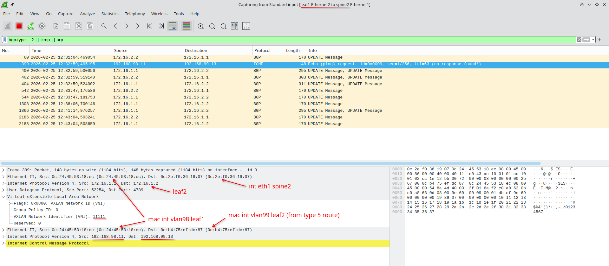
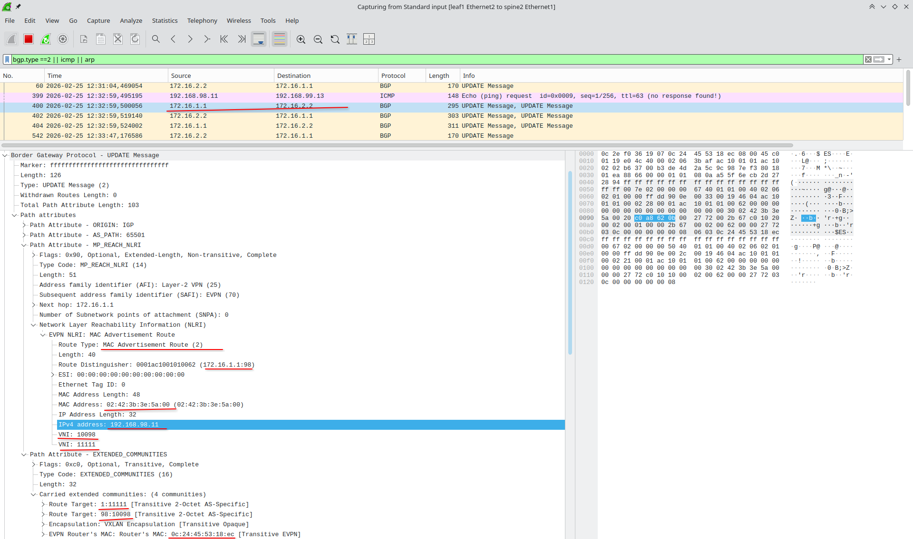
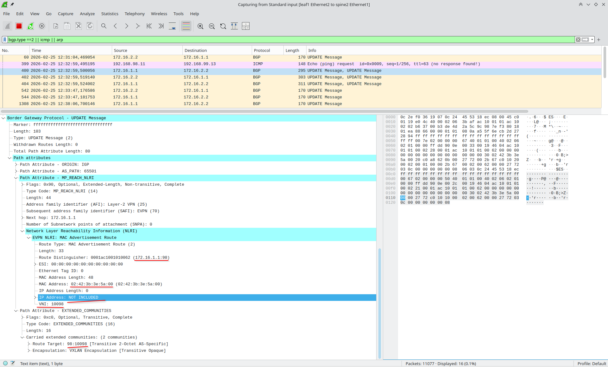
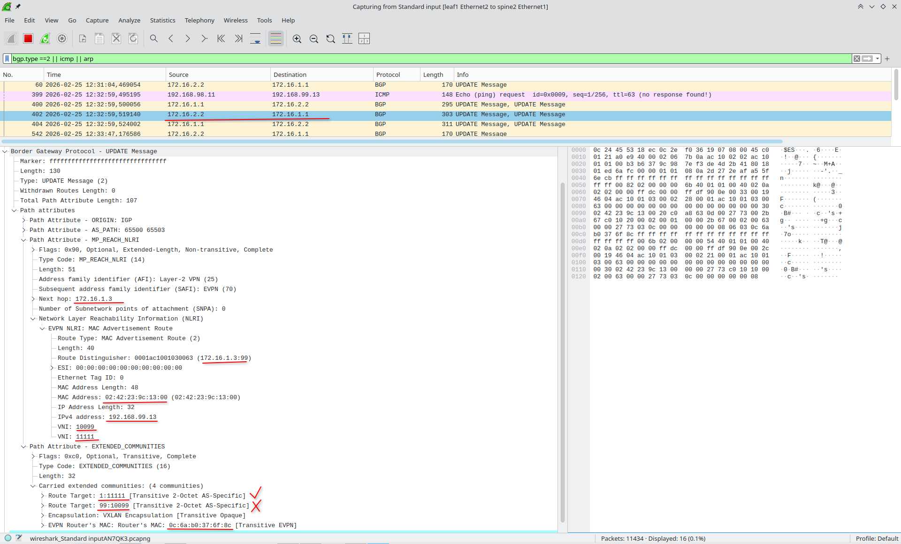
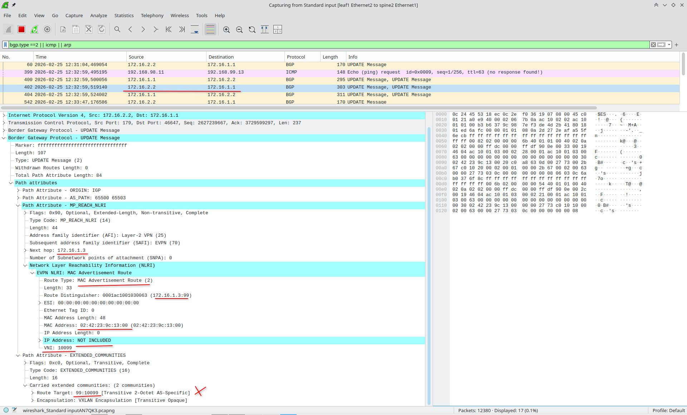
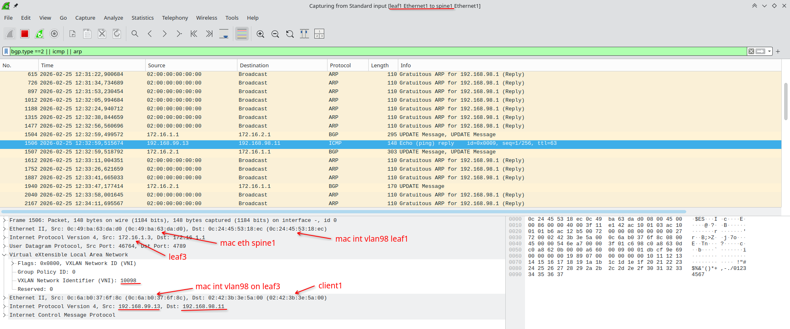
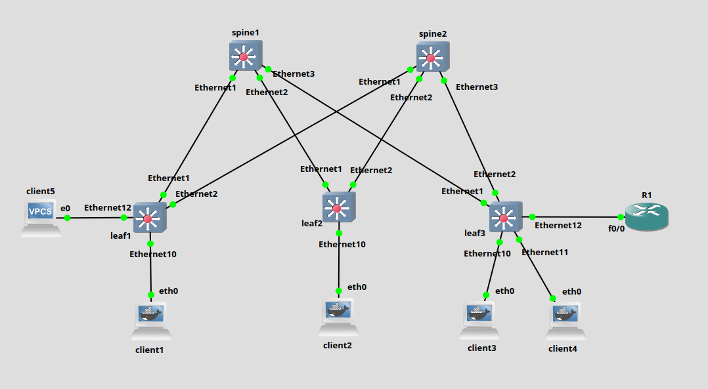

# Lab6
## Схема:

## План работ:
- Схему и адресацию используем из лабы 1
- Фиксим недочёт: **увеличиваем mtu** на интерфейсах между лифами и спайнами
- Андерлей берём из лабы 2 (OSPF)
- EVPN L2 берём из лабы 5 (на leaf1 оставляем только 98 vlan)
- Настраиваем клиентские машины:
	- client1: vlan 98 - 192.168.98.11/24 02:42:3b:3e:5a:00
	- client2: vlan 99 - 192.168.99.12/24 02:42:92:f8:ca:00
	- client3: vlan 99 - 192.168.99.13/24 02:42:23:9c:13:00
	- client4: vlan 98 - 192.168.98.14/24 02:42:b3:4b:98:00
- Используем **симметричную IRB**
## Таблица лупбеков
- Spine1 - 172.16.2.1/32
- Spine2 - 172.16.2.2/32
- Leaf1 - 172.16.1.1/32
- Leaf2 - 172.16.1.2/32
- Leaf3 - 172.16.1.3/32

## Примеры конфигурации
Все настройки выполняются только на лифах.
#### Leaf1
```
!  
vlan 98  
  name VLAN98  
!  
vrf instance VRF1  
!  
interface Ethernet1  
  mtu 1600
  no switchport  
  ip address 10.1.1.1/30  
  ip ospf network point-to-point  
  ip ospf area 0.0.0.1  
!  
interface Ethernet2  
  mtu 1600
  no switchport  
  ip address 10.1.2.1/30  
  ip ospf network point-to-point  
  ip ospf area 0.0.0.1  
!  
interface Ethernet10  
  switchport trunk allowed vlan 98  
  switchport mode trunk  
!  
interface Loopback0  
  ip address 172.16.1.1/32  
  ip ospf area 0.0.0.1  
!
interface Vlan98
  vrf VRF1  
  ip address 192.168.98.201/24  
  ip virtual-router address 192.168.98.1  
!  
interface Vxlan1  
  vxlan source-interface Loopback0  
  vxlan udp-port 4789  
  vxlan vlan 98 vni 10098  
  vxlan vrf VRF1 vni 11111  
  vxlan learn-restrict any  
!  
ip virtual-router mac-address 02:00:00:00:00:00  
!  
ip routing  
ip routing vrf VRF1  
!  
router bgp 65501  
  router-id 172.16.1.1  
  no bgp default ipv4-unicast  
  timers bgp 3 9  
  neighbor EVPN_POD1 peer group  
  neighbor EVPN_POD1 remote-as 65500  
  neighbor EVPN_POD1 update-source Loopback0  
  neighbor EVPN_POD1 bfd  
  neighbor EVPN_POD1 ebgp-multihop 2  
  neighbor EVPN_POD1 send-community extended  
  neighbor 172.16.2.1 peer group EVPN_POD1  
  neighbor 172.16.2.2 peer group EVPN_POD1  
  !  
  vlan 98  
     rd auto  
     route-target both 98:10098  
     redistribute learned  
  !  
  address-family evpn  
     neighbor EVPN_POD1 activate  
  !  
  vrf VRF1  
     rd 65501:1  
     route-target import evpn 1:11111  
     route-target export evpn 1:11111  
     redistribute connected  
!
```
#### Leaf2
```
!  
vlan 99  
  name VLAN99  
!  
vrf instance VRF1  
!  
interface Ethernet1  
  mtu 1600
  no switchport  
  ip address 10.1.1.5/30  
  ip ospf network point-to-point  
  ip ospf area 0.0.0.1  
!  
interface Ethernet2  
  mtu 1600
  no switchport  
  ip address 10.1.2.5/30  
  ip ospf network point-to-point  
  ip ospf area 0.0.0.1  
!  
interface Ethernet10  
  switchport access vlan 99  
!  
interface Loopback0  
  ip address 172.16.1.2/32  
  ip ospf area 0.0.0.1  
!  
interface Vlan99  
  vrf VRF1  
  ip address 192.168.99.202/24  
  ip virtual-router address 192.168.99.1  
!  
interface Vxlan1  
  vxlan source-interface Loopback0  
  vxlan udp-port 4789  
  vxlan vlan 99 vni 10099  
  vxlan vrf VRF1 vni 11111  
  vxlan learn-restrict any  
!  
ip virtual-router mac-address 02:00:00:00:00:00  
!  
ip routing  
ip routing vrf VRF1  
!  
router bgp 65502  
  router-id 172.16.1.2  
  no bgp default ipv4-unicast  
  timers bgp 3 9  
  neighbor EVPN_POD1 peer group  
  neighbor EVPN_POD1 remote-as 65500  
  neighbor EVPN_POD1 update-source Loopback0  
  neighbor EVPN_POD1 bfd  
  neighbor EVPN_POD1 ebgp-multihop 2  
  neighbor EVPN_POD1 send-community extended  
  neighbor 172.16.2.1 peer group EVPN_POD1  
  neighbor 172.16.2.2 peer group EVPN_POD1  
  !  
  vlan 99  
     rd auto  
     route-target both 99:10099  
     redistribute learned  
  !  
  address-family evpn  
     neighbor EVPN_POD1 activate  
  !  
  vrf VRF1  
     rd 65502:1  
     route-target import evpn 1:11111  
     route-target export evpn 1:11111  
     redistribute connected  
!  
```
#### Leaf3
```
!  
vlan 98  
  name VLAN98  
!  
vlan 99  
  name VLAN99  
!  
vrf instance VRF1  
!  
interface Ethernet1  
  mtu 1600
  no switchport  
  ip address 10.1.1.9/30  
  ip ospf network point-to-point  
  ip ospf area 0.0.0.1  
!  
interface Ethernet2  
  mtu 1600
  no switchport  
  ip address 10.1.2.9/30  
  ip ospf network point-to-point  
  ip ospf area 0.0.0.1  
!  
interface Ethernet10  
  switchport access vlan 99  
!  
interface Ethernet11  
  switchport access vlan 98  
!  
interface Loopback0  
  ip address 172.16.1.3/32  
  ip ospf area 0.0.0.1  
!  
interface Vlan98  
  vrf VRF1  
  ip address 192.168.98.203/24  
  ip virtual-router address 192.168.98.1  
!  
interface Vlan99  
  vrf VRF1  
  ip address 192.168.99.203/24  
  ip virtual-router address 192.168.99.1  
!  
interface Vxlan1  
  vxlan source-interface Loopback0  
  vxlan udp-port 4789  
  vxlan vlan 98 vni 10098  
  vxlan vlan 99 vni 10099  
  vxlan vrf VRF1 vni 11111  
  vxlan learn-restrict any  
!  
ip virtual-router mac-address 02:00:00:00:00:00  
!  
ip routing  
ip routing vrf VRF1  
!  
router bgp 65503  
  router-id 172.16.1.3  
  no bgp default ipv4-unicast  
  timers bgp 3 9  
  neighbor EVPN_POD1 peer group  
  neighbor EVPN_POD1 remote-as 65500  
  neighbor EVPN_POD1 update-source Loopback0  
  neighbor EVPN_POD1 bfd  
  neighbor EVPN_POD1 ebgp-multihop 2  
  neighbor EVPN_POD1 send-community extended  
  neighbor 172.16.2.1 peer group EVPN_POD1  
  neighbor 172.16.2.2 peer group EVPN_POD1  
  !  
  vlan 98  
     rd auto  
     route-target both 98:10098  
     redistribute learned  
  !  
  vlan 99  
     rd auto  
     route-target both 99:10099  
     redistribute learned  
  !  
  address-family evpn  
     neighbor EVPN_POD1 activate  
  !  
  vrf VRF1  
     rd 65503:1  
     route-target import evpn 1:11111  
     route-target export evpn 1:11111  
     redistribute connected  
!  
```

## Результаты сразу после включения:
Лифы ещё не изучили mac-/ip-адреса хостов.
#### Leaf1:
```
leaf1#sh ip route vrf VRF1    
VRF: VRF1 
Gateway of last resort is not set  
C        192.168.98.0/24  
          directly connected, Vlan98  
B E      192.168.99.0/24 [200/0]  
          via VTEP 172.16.1.2 VNI 11111 router-mac 0c:b4:75:ef:dc:87 local-interface Vxlan1

leaf1#sh bgp evpn route-type ip-prefix ipv4  
BGP routing table information for VRF default  
Router identifier 172.16.1.1, local AS number 65501  
Route status codes: * - valid, > - active, S - Stale, E - ECMP head, e - ECMP  
                   c - Contributing to ECMP, % - Pending best path selection  
Origin codes: i - IGP, e - EGP, ? - incomplete  
AS Path Attributes: Or-ID - Originator ID, C-LST - Cluster List, LL Nexthop - Link Local Nexthop  
  
         Network                Next Hop              Metric  LocPref Weight  Path  
* >      RD: 65501:1 ip-prefix 192.168.98.0/24  
                                -                     -       -       0       i  
* >      RD: 65503:1 ip-prefix 192.168.98.0/24  
                                172.16.1.3            -       100     0       65500 65503 i  
*        RD: 65503:1 ip-prefix 192.168.98.0/24  
                                172.16.1.3            -       100     0       65500 65503 i  
* >      RD: 65502:1 ip-prefix 192.168.99.0/24  
                                172.16.1.2            -       100     0       65500 65502 i  
*        RD: 65502:1 ip-prefix 192.168.99.0/24  
                                172.16.1.2            -       100     0       65500 65502 i  
* >      RD: 65503:1 ip-prefix 192.168.99.0/24  
                                172.16.1.3            -       100     0       65500 65503 i  
*        RD: 65503:1 ip-prefix 192.168.99.0/24  
                                172.16.1.3            -       100     0       65500 65503 i
```
#### Leaf2:
```
leaf2#sh ip route vrf VRF1  
VRF: VRF1  
Gateway of last resort is not set  
B E      192.168.98.0/24 [200/0]  
          via VTEP 172.16.1.1 VNI 11111 router-mac 0c:24:45:53:18:ec local-interface Vxlan1  
C        192.168.99.0/24  
          directly connected, Vlan99

leaf2#sh bgp evpn route-type ip-prefix ipv4  
BGP routing table information for VRF default  
Router identifier 172.16.1.2, local AS number 65502  
Route status codes: * - valid, > - active, S - Stale, E - ECMP head, e - ECMP  
                   c - Contributing to ECMP, % - Pending best path selection  
Origin codes: i - IGP, e - EGP, ? - incomplete  
AS Path Attributes: Or-ID - Originator ID, C-LST - Cluster List, LL Nexthop - Link Local Nexthop  
  
         Network                Next Hop              Metric  LocPref Weight  Path  
* >      RD: 65501:1 ip-prefix 192.168.98.0/24  
                                172.16.1.1            -       100     0       65500 65501 i  
*        RD: 65501:1 ip-prefix 192.168.98.0/24  
                                172.16.1.1            -       100     0       65500 65501 i  
* >      RD: 65503:1 ip-prefix 192.168.98.0/24  
                                172.16.1.3            -       100     0       65500 65503 i  
*        RD: 65503:1 ip-prefix 192.168.98.0/24  
                                172.16.1.3            -       100     0       65500 65503 i  
* >      RD: 65502:1 ip-prefix 192.168.99.0/24  
                                -                     -       -       0       i  
* >      RD: 65503:1 ip-prefix 192.168.99.0/24  
                                172.16.1.3            -       100     0       65500 65503 i  
*        RD: 65503:1 ip-prefix 192.168.99.0/24  
                                172.16.1.3            -       100     0       65500 65503 i
```
#### Leaf3:
```
leaf3#sh ip route vrf VRF1
VRF: VRF1
Gateway of last resort is not set  
C        192.168.98.0/24  
          directly connected, Vlan98  
C        192.168.99.0/24  
          directly connected, Vlan99

leaf3#sh bgp evpn route-type ip-prefix ipv4  
BGP routing table information for VRF default  
Router identifier 172.16.1.3, local AS number 65503  
Route status codes: * - valid, > - active, S - Stale, E - ECMP head, e - ECMP  
                   c - Contributing to ECMP, % - Pending best path selection  
Origin codes: i - IGP, e - EGP, ? - incomplete  
AS Path Attributes: Or-ID - Originator ID, C-LST - Cluster List, LL Nexthop - Link Local Nexthop  
  
         Network                Next Hop              Metric  LocPref Weight  Path  
* >      RD: 65501:1 ip-prefix 192.168.98.0/24  
                                172.16.1.1            -       100     0       65500 65501 i  
*        RD: 65501:1 ip-prefix 192.168.98.0/24  
                                172.16.1.1            -       100     0       65500 65501 i  
* >      RD: 65503:1 ip-prefix 192.168.98.0/24  
                                -                     -       -       0       i  
* >      RD: 65502:1 ip-prefix 192.168.99.0/24  
                                172.16.1.2            -       100     0       65500 65502 i  
*        RD: 65502:1 ip-prefix 192.168.99.0/24  
                                172.16.1.2            -       100     0       65500 65502 i  
* >      RD: 65503:1 ip-prefix 192.168.99.0/24  
                                -                     -       -       0       i
```
#### Анализ
Видим, что каждый лиф поделился своим type 5 маршрутом, однако в таблицу маршрутизации в VRF1 попало только по 1 (best path) маршруту: 
- для leaf1 - 99 сеть доступна через leaf2
- для leaf2 - 98 сеть доступна через leaf1

Таким образом нужно проверить, будет ли доступен client3 (за leaf3 в 99 влане) из хоста client1 (за leaf1 в 98 влане) и как пойдёт трафик.
```
root@client1:/# ping -c 1 192.168.99.13
PING 192.168.99.13 (192.168.99.13) 56(84) bytes of data.  
64 bytes from 192.168.99.13: icmp_seq=1 ttl=63 time=22.9 ms  
  
--- 192.168.99.13 ping statistics ---  
1 packets transmitted, 1 received, 0% packet loss, time 0ms  
rtt min/avg/max/mdev = 22.861/22.861/22.861/0.000 ms
```
ICMP запрос отправляется с leaf1 на leaf2 и следом за ним leaf1 рассылает type-2 маршруты: mac only и mac+ip с настроенными ранее рут таргетами mac и ip vrf.



Далее на leaf2 пакет маршрутизируется в vlan99 и далее уже коммутируется до client3, предварительно запросив mac-адрес client3 с помощью ARP.
Таким образом leaf3 узнаёт о существовании client3 и также рассылает type-2 маршруты:


И снова можно было бы подумать, что mac only маршрут не должен сохраниться на leaf1, но нет, они сохраняются, но вот в таблицу mac-адресов или vxlan address-table уже не попадают.
Подозреваю, что на нексусах другое поведение, если не включать retain route-target all.
```
leaf1#sh bgp evpn route-type mac-ip 0242.239c.1300 det
BGP routing table information for VRF default  
Router identifier 172.16.1.1, local AS number 65501  
BGP routing table entry for mac-ip 0242.239c.1300, Route Distinguisher: 172.16.1.3:99  
Paths: 2 available  
 65500 65503  
   172.16.1.3 from 172.16.2.2 (172.16.2.2)  
     Origin IGP, metric -, localpref 100, weight 0, tag 0, valid, external, ECMP head, ECMP, best, ECMP contributor  
     Extended Community: Route-Target-AS:99:10099 TunnelEncap:tunnelTypeVxlan  
     VNI: 10099 ESI: 0000:0000:0000:0000:0000  
 65500 65503  
   172.16.1.3 from 172.16.2.1 (172.16.2.1)  
     Origin IGP, metric -, localpref 100, weight 0, tag 0, valid, external, ECMP, ECMP contributor  
     Extended Community: Route-Target-AS:99:10099 TunnelEncap:tunnelTypeVxlan  
     VNI: 10099 ESI: 0000:0000:0000:0000:0000  
BGP routing table entry for mac-ip 0242.239c.1300 192.168.99.13, Route Distinguisher: 172.16.1.3:99  
Paths: 2 available  
 65500 65503  
   172.16.1.3 from 172.16.2.2 (172.16.2.2)  
     Origin IGP, metric -, localpref 100, weight 0, tag 0, valid, external, ECMP head, ECMP, best, ECMP contributor  
     Extended Community: Route-Target-AS:1:11111 Route-Target-AS:99:10099 TunnelEncap:tunnelTypeVxlan EvpnRouterMac  
:0c:6a:b0:37:6f:8c  
     VNI: 10099 L3 VNI: 11111 ESI: 0000:0000:0000:0000:0000  
 65500 65503  
   172.16.1.3 from 172.16.2.1 (172.16.2.1)  
     Origin IGP, metric -, localpref 100, weight 0, tag 0, valid, external, ECMP, ECMP contributor  
     Extended Community: Route-Target-AS:1:11111 Route-Target-AS:99:10099 TunnelEncap:tunnelTypeVxlan EvpnRouterMac  
:0c:6a:b0:37:6f:8c  
     VNI: 10099 L3 VNI: 11111 ESI: 0000:0000:0000:0000:0000
```
Ну и ответ на icmp:

Теперь leaf1 благодаря *Route-Target-AS:1:11111* знает маршрут к 192.168.99.13/32 (client3) напрямую через leaf3 и следующие пакеты будет слать через него, а не через leaf2.
## Проверка доступности

#### Client1:
```
root@client1:/# traceroute 192.168.99.12  
traceroute to 192.168.99.12 (192.168.99.12), 30 hops max, 60 byte packets  
1  * * *  
2  192.168.99.202 (192.168.99.202)  7.995 ms  11.047 ms  14.379 ms  
3  192.168.99.12 (192.168.99.12)  14.967 ms  16.583 ms  15.627 ms  

root@client1:/# traceroute 192.168.99.12  
traceroute to 192.168.99.12 (192.168.99.12), 30 hops max, 60 byte packets  
1  * * *  
2  192.168.99.202 (192.168.99.202)  9.520 ms  10.419 ms  11.269 ms  
3  192.168.99.12 (192.168.99.12)  18.488 ms  19.372 ms  18.000 ms  

root@client1:/# traceroute 192.168.99.13  
traceroute to 192.168.99.13 (192.168.99.13), 30 hops max, 60 byte packets  
1  * * *  
2  192.168.99.203 (192.168.99.203)  10.777 ms  12.625 ms  13.423 ms  
3  192.168.99.13 (192.168.99.13)  16.917 ms  18.521 ms  19.877 ms  

root@client1:/# traceroute 192.168.98.14  
traceroute to 192.168.98.14 (192.168.98.14), 30 hops max, 60 byte packets  
1  192.168.98.14 (192.168.98.14)  18.688 ms  19.756 ms  20.512 ms
```
#### Client2:
```
root@client2:/# traceroute 192.168.98.11      
traceroute to 192.168.98.11 (192.168.98.11), 30 hops max, 60 byte packets  
1  * * *  
2  192.168.98.201 (192.168.98.201)  13.411 ms  13.957 ms  15.572 ms  
3  192.168.98.11 (192.168.98.11)  19.407 ms  20.336 ms  17.654 ms  

root@client2:/# traceroute 192.168.98.14  
traceroute to 192.168.98.14 (192.168.98.14), 30 hops max, 60 byte packets  
1  * * *  
2  192.168.99.203 (192.168.99.203)  12.106 ms  12.734 ms  15.116 ms  
3  192.168.98.14 (192.168.98.14)  16.844 ms  19.143 ms  19.845 ms  

root@client2:/# traceroute 192.168.99.13  
traceroute to 192.168.99.13 (192.168.99.13), 30 hops max, 60 byte packets  
1  192.168.99.13 (192.168.99.13)  19.590 ms  19.956 ms  20.225 ms
```
#### Client3:
```
root@client3:/# traceroute 192.168.98.11  
traceroute to 192.168.98.11 (192.168.98.11), 30 hops max, 60 byte packets  
1  * * *  
2  192.168.98.201 (192.168.98.201)  13.869 ms  12.986 ms  14.497 ms  
3  192.168.98.11 (192.168.98.11)  18.032 ms  18.414 ms  19.398 ms  

root@client3:/# traceroute 192.168.99.12  
traceroute to 192.168.99.12 (192.168.99.12), 30 hops max, 60 byte packets  
1  192.168.99.12 (192.168.99.12)  14.157 ms  14.437 ms  19.167 ms  

root@client3:/# traceroute 192.168.98.14  
traceroute to 192.168.98.14 (192.168.98.14), 30 hops max, 60 byte packets  
1  * * *  
2  192.168.98.14 (192.168.98.14)  10.982 ms  11.134 ms  11.482 ms
```

## Настройка второго vrf и inter-vrf маршрутизации:
Добавим новый хост client5 к leaf1 и устройство, которое будет маршрутизировать между VRF, условный фаервол - R1.

#### Leaf1
Добавляем VRF2, включаем роутинг
  ```
  vrf instance VRF2
  ip routing vrf VRF2
  ```
Помещаем клиента в отдельный влан - 88, настраиваем SVI, помещаем в VRF2
  ```
  vlan 88  
	  name VLAN88  
  interface Ethernet12  
	  switchport access vlan 88
  interface Vlan88  
	  vrf VRF2  
	  ip address 192.168.88.201/24  
	  ip virtual-router address 192.168.88.1
  ```
Мапим vlan 88 в vni 10088 на случай, если эта сеть нужна на других vtep-ах
  ```
  interface Vxlan1  
	  vxlan vlan 88 vni 10088
  ```
Мапим VRF2 в vni 22222
  ```
  interface Vxlan1 
	  vxlan vrf VRF2 vni 22222
  ```
Настраиваем bgp
  ```
  router bgp 65501
	vlan 88  
     rd auto  
     route-target both 88:10088  
     redistribute learned  
	vrf VRF2  
     rd 65501:2  
     route-target import evpn 2:22222  
     route-target export evpn 2:22222  
     redistribute connected
  ```
#### Leaf3
Добавляем VRF2, включаем роутинг
  ```
  vrf instance VRF2
  ip routing vrf VRF2
  ```
Создаём 2 новых влана - 87 и 86 для разных VRF, настраиваем SVI
```
vlan 86  
   name VRF1GW
vlan 87
   name VRF2GW
interface Vlan86
   vrf VRF1
   ip address 192.168.86.1/30
interface Vlan87
   vrf VRF2
   ip address 192.168.87.1/30
``` 
Мапинг новых вланов в vni не делаем, т.к. эти сети существуют только на leaf3
Мапим VRF2 в vni 22222
  ```
  interface Vxlan1 
	  vxlan vrf VRF2 vni 22222
  ```
Настраиваем bgp
  ```
  router bgp 65503
	vrf VRF2  
     rd 65503:2  
     route-target import evpn 2:22222  
     route-target export evpn 2:22222  
     redistribute connected
  ```
#### R1
Настраиваем Router-on-a-stick и добавляем маршруты в каждую подсеть в vrf-ах через leaf3:
```
interface FastEthernet0/0.86  
encapsulation dot1Q 86  
ip address 192.168.86.2 255.255.255.252  
!  
interface FastEthernet0/0.87  
encapsulation dot1Q 87  
ip address 192.168.87.2 255.255.255.252
!
ip route 192.168.88.0 255.255.255.0 192.168.87.1  
ip route 192.168.98.0 255.255.255.0 192.168.86.1  
ip route 192.168.99.0 255.255.255.0 192.168.86.1
```
####
Добавляем дефолтные маршруты для каждого vrf на каждом лифе:
```
ip route vrf VRF1 0.0.0.0/0 192.168.86.2
ip route vrf VRF2 0.0.0.0/0 192.168.87.2
```
## В итоге получаем:
#### Leaf1
```
!  
vlan 88  
  name VLAN88  
!  
vlan 98  
  name VLAN98  
!  
vrf instance VRF1  
!  
vrf instance VRF2  
!  
interface Ethernet1  
  mtu 1600  
  no switchport  
  ip address 10.1.1.1/30  
  ip ospf network point-to-point  
  ip ospf area 0.0.0.1  
!  
interface Ethernet2  
  mtu 1600  
  no switchport  
  ip address 10.1.2.1/30  
  ip ospf network point-to-point  
  ip ospf area 0.0.0.1  
!  
interface Ethernet10  
  switchport trunk allowed vlan 98  
  switchport mode trunk  
!  
interface Ethernet12  
  switchport access vlan 88  
!  
interface Loopback0  
  ip address 172.16.1.1/32  
  ip ospf area 0.0.0.1   
!  
interface Vlan88  
  vrf VRF2  
  ip address 192.168.88.201/24  
  ip virtual-router address 192.168.88.1  
!  
interface Vlan98  
  vrf VRF1  
  ip address 192.168.98.201/24  
  ip virtual-router address 192.168.98.1  
!  
interface Vxlan1  
  vxlan source-interface Loopback0  
  vxlan udp-port 4789  
  vxlan vlan 88 vni 10088  
  vxlan vlan 98 vni 10098  
  vxlan vrf VRF1 vni 11111  
  vxlan vrf VRF2 vni 22222  
  vxlan learn-restrict any  
!  
ip virtual-router mac-address 02:00:00:00:00:00  
!  
ip routing  
ip routing vrf VRF1  
ip routing vrf VRF2  
!  
ip route vrf VRF1 0.0.0.0/0 192.168.86.2  
ip route vrf VRF2 0.0.0.0/0 192.168.87.2  
!  
router bgp 65501  
  router-id 172.16.1.1  
  no bgp default ipv4-unicast  
  timers bgp 3 9  
  neighbor EVPN_POD1 peer group  
  neighbor EVPN_POD1 remote-as 65500  
  neighbor EVPN_POD1 update-source Loopback0  
  neighbor EVPN_POD1 bfd  
  neighbor EVPN_POD1 ebgp-multihop 2  
  neighbor EVPN_POD1 send-community extended  
  neighbor 172.16.2.1 peer group EVPN_POD1  
  neighbor 172.16.2.2 peer group EVPN_POD1  
  !  
  vlan 88  
     rd auto  
     route-target both 88:10088  
     redistribute learned  
  !  
  vlan 98  
     rd auto  
     route-target both 98:10098  
     redistribute learned  
  !  
  address-family evpn  
     neighbor EVPN_POD1 activate  
  !  
  vrf VRF1  
     rd 65501:1  
     route-target import evpn 1:11111  
     route-target export evpn 1:11111  
     redistribute connected  
  !  
  vrf VRF2  
     rd 65501:2  
     route-target import evpn 2:22222  
     route-target export evpn 2:22222  
     redistribute connected  
!
```
#### Leaf3:
```
vlan 86  
  name VRF1GW  
!  
vlan 87  
  name VRF2GW  
!  
vlan 98  
  name VLAN98  
!  
vlan 99  
  name VLAN99  
!  
vrf instance VRF1  
!  
vrf instance VRF2  
!  
interface Ethernet1  
  mtu 1600  
  no switchport  
  ip address 10.1.1.9/30  
  ip ospf network point-to-point  
  ip ospf area 0.0.0.1  
!  
interface Ethernet2  
  mtu 1600  
  no switchport  
  ip address 10.1.2.9/30  
  ip ospf network point-to-point  
  ip ospf area 0.0.0.1  
!
interface Ethernet10  
  switchport access vlan 99  
!  
interface Ethernet12  
  switchport trunk allowed vlan 86-87  
  switchport mode trunk  
!  
interface Loopback0  
  ip address 172.16.1.3/32  
  ip ospf area 0.0.0.1  
!  
interface Vlan86  
  vrf VRF1  
  ip address 192.168.86.1/30  
!  
interface Vlan87  
  vrf VRF2  
  ip address 192.168.87.1/30  
!  
interface Vlan98  
  vrf VRF1  
  ip address 192.168.98.203/24  
  ip virtual-router address 192.168.98.1  
!  
interface Vlan99  
  vrf VRF1  
  ip address 192.168.99.203/24  
  ip virtual-router address 192.168.99.1  
!  
interface Vxlan1  
  vxlan source-interface Loopback0  
  vxlan udp-port 4789  
  vxlan vlan 98 vni 10098  
  vxlan vlan 99 vni 10099  
  vxlan vrf VRF1 vni 11111  
  vxlan vrf VRF2 vni 22222  
  vxlan learn-restrict any  
!  
ip virtual-router mac-address 02:00:00:00:00:00  
!  
ip routing  
ip routing vrf VRF1  
ip routing vrf VRF2  
!  
ip route vrf VRF1 0.0.0.0/0 192.168.86.2  
ip route vrf VRF2 0.0.0.0/0 192.168.87.2  
!  
router bgp 65503  
  router-id 172.16.1.3  
  no bgp default ipv4-unicast  
  timers bgp 3 9  
  neighbor EVPN_POD1 peer group  
  neighbor EVPN_POD1 remote-as 65500  
  neighbor EVPN_POD1 update-source Loopback0  
  neighbor EVPN_POD1 bfd  
  neighbor EVPN_POD1 ebgp-multihop 2  
  neighbor EVPN_POD1 send-community extended  
  neighbor 172.16.2.1 peer group EVPN_POD1  
  neighbor 172.16.2.2 peer group EVPN_POD1  
  !  
  vlan 98  
     rd auto  
     route-target both 98:10098  
     redistribute learned  
  !  
  vlan 99  
     rd auto  
     route-target both 99:10099  
     redistribute learned  
  !  
  address-family evpn  
     neighbor EVPN_POD1 activate  
  !  
  vrf VRF1  
     rd 65503:1  
     route-target import evpn 1:11111  
     route-target export evpn 1:11111  
     redistribute connected  
  !  
  vrf VRF2  
     rd 65503:2  
     route-target import evpn 2:22222  
     route-target export evpn 2:22222  
     redistribute connected  
!
```
## Проверка доступности с client5:
```
client5> trace 192.168.98.11 -P 1                    
trace to 192.168.98.11, 8 hops max (ICMP), press Ctrl+C to stop  
1     *  *  *                                         <- leaf1
2   192.168.87.1   5.536 ms  3.890 ms  3.638 ms       <- leaf3 vrf2
3   192.168.87.2   8.373 ms  10.983 ms  8.659 ms      <- R1
4   192.168.86.1   20.168 ms  19.483 ms  20.438 ms    <- leaf3 vrf1
5   192.168.98.201   18.182 ms  18.847 ms  19.835 ms  <- leaf1
6   192.168.98.11   20.042 ms  19.473 ms  20.122 ms   <- client1

client5> trace 192.168.98.14 -P 1  
trace to 192.168.98.14, 8 hops max (ICMP), press Ctrl+C to stop  
1     *  *  *  
2   192.168.87.1   5.331 ms  3.717 ms  3.530 ms  
3   192.168.87.2   5.475 ms  9.826 ms  9.494 ms  
4   192.168.86.1   20.143 ms  21.069 ms  18.988 ms  
5   192.168.98.14   19.676 ms  19.415 ms  19.548 ms   <- client4
  
client5> trace 192.168.99.12 -P 1  
trace to 192.168.99.12, 8 hops max (ICMP), press Ctrl+C to stop  
1     *  *  *  
2   192.168.87.1   5.030 ms  3.740 ms  3.844 ms  
3   192.168.87.2   15.492 ms  9.032 ms  10.028 ms  
4   192.168.86.1   19.735 ms  19.615 ms  19.413 ms  
5   192.168.99.202   19.350 ms  18.328 ms  19.834 ms  <- leaf2
6   192.168.99.12   19.706 ms  20.260 ms  17.853 ms   <- client2
  
client5> trace 192.168.99.13 -P 1  
trace to 192.168.99.13, 8 hops max (ICMP), press Ctrl+C to stop  
1     *  *  *  
2   192.168.87.1   4.863 ms  3.757 ms  3.438 ms  
3   192.168.87.2   15.925 ms  9.790 ms  8.620 ms  
4   192.168.86.1   20.211 ms  19.348 ms  19.356 ms  
5   192.168.99.13   19.880 ms  19.116 ms  19.949 ms   <- client3
```